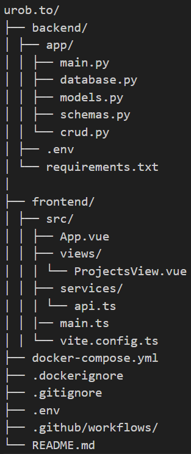

# urob.to

Jednoduchá fullstack webová aplikácia na správu projektov a úloh.  
Podporuje viac používateľov, tagy, a stav úloh.

>**Technológie**:  
> Verzie knižníč sú obsiahnuté v requirements.txt
>
>- Backend: Python (FastAPI) + PostgreSQL  
>- Frontend: Vue 3 + TypeScript + Vite  
>- Deployment: Docker & GitHub Actions  

---

## Obsah


- [urob.to](#urobto)
  - [Obsah](#obsah)
  - [O projekte](#o-projekte)
  - [Štruktúra projektu](#štruktúra-projektu)
  - [Inštalácia (lokálne)](#inštalácia-lokálne)
    - [0. Pripravenie stroja](#0-pripravenie-stroja)
    - [1. Vytvorenie `.env` súborov v projekte:](#1-vytvorenie-env-súborov-v-projekte)
    - [Spustenie kontajnerov cez Docker Compose](#spustenie-kontajnerov-cez-docker-compose)
  - [Backend (API)](#backend-api)
  - [Frontend](#frontend)
  - [API endpointy](#api-endpointy)
  - [CI/CD \& Docker](#cicd--docker)
  - [Poznámky](#poznámky)

---

## O projekte

`urob.to` je webová aplikácia, kde je možné:
- Vytvárať projekty a priradzovať úlohy
- Označovať úlohy tagmi a priraďovať používateľov
- Odškrtávať hotové úlohy

---

## Štruktúra projektu

<!-- urob.to/
├── backend/ 
│ ├── app/
│ │ ├── main.py 
│ │ ├── database.py 
│ │ ├── models.py 
│ │ ├── schemas.py
│ │ └── crud.py 
│ ├── .env
│ └── requirements.txt
|
├── frontend/
│ ├── src/
│ │ ├── App.vue 
│ │ ├── views/
| | | └── ProjectsView.vue
│ │ ├── services/
| | | └── api.ts
│ │ |── main.ts 
│ | └── vite.config.ts
├── docker-compose.yml
├── .dockerignore
├── .gitignore
├── .env
├── .github/workflows/
└── README.md -->



## Inštalácia (lokálne)

### 0. Pripravenie stroja 

Pred samotným spustením je potrebné sa uistiť, že sú nainštalované všetky potrebné nástroje

- [Node.js a npm](https://nodejs.org/) – pre frontend a správu JavaScript balíkov
- [Python 3.10+](https://www.python.org/downloads/) – pre backend (v prípade spúšťania bez Dockeru)
- [Docker + Docker Desktop](https://www.docker.com/products/docker-desktop/) – na spúšťanie kontajnerov
- [Git](https://git-scm.com/) – na klonovanie repozitára a prácu s verziami

> Odporúčané: Použitie Dockera pre jednoduché spustenie bez ručnej inštalácie závislostí. (ak nie je potrebné robiť žiadne modifikácie v zdrojovom kóde)


### 1. Vytvorenie `.env` súborov v projekte:


```env
# .env v roote projektu pre docker-compose.yml

# DB settings - modify up to your settings
POSTGRES_USER=your_user
POSTGRES_PASSWORD=your_pwd
POSTGRES_DB=your_db
POSTGRES_PORT=your_port
POSTGRES_HOST=your_host

# Frontend to backend connection
VITE_API_URL=http://localhost:8000 

# DockerHub settings for docker-compose build // ci-cd dependent on Github Actions repository secrets 
DOCKERHUB_USERNAME=your_username
```

```env
# .env súbor pre backend - root/backend/.env

# DB settings - modify up to your settings
POSTGRES_USER=your_user
POSTGRES_PASSWORD=your_pwd
POSTGRES_DB=your_db
POSTGRES_PORT=your_port
POSTGRES_HOST=your_db
```

```env
# .env súbor pre frontend - root/frontend/.env

VITE_API_URL=http://localhost:8000
```

```github_secrets
# Nastavenie Github repository secrets

DOCKERHUB_TOKEN=your_token
DOCKERHUB_USERNAME=your_username
POSTGRES_DB=your_db
POSTGRES_PASSWORD=your_password
POSTGRES_USER=your_user
VITE_API_URL=http://localhost:8000
```

### Spustenie kontajnerov cez Docker Compose
```bash
docker compose build
docker compose up -d
```

Kde Backend beží na ```http://localhost:8000``` a Frontend beží na ```http://localhost:80```

## Backend (API)
- Framework: FastAPI
- DB: PostgreSQL
- ORM: SQLAlchemy
- Validácia: Pydantic
- Endpointy sú definované v ```backend/app/crud.py```
- Pripojenie na databázu sa číta z env premenných

Príklad DB URL:
```postgresql://postgres:postgres@db:5432/todo_db```

## Frontend
- Framework: Vue 3 + TypeScript
- Build nástroj: Vite
- Hlavný komponent: ```ProjectsView.vue```
- API volania sú definované v ```frontend/src/services/api.ts``` 

## API endpointy

| Metóda |      Cesta     |              Popis             |  
|:------:|:--------------:|:------------------------------:|
| GET    | /projects/     | Zoznam všetkých projektov      |
| POST   | /projects/     | Vytvorenie nového projektu     |
| PUT    | /projects/{id} | Úprava existujúceho projektu   |
| DELETE | /projects/{id} | Vymazanie projektu             |
| PUT    | /tasks/{id}    | Zmena stavu alebo úprava úlohy |
| GET    | /tags/         | Zoznam tagov                   |
| GET    | /users/        | Zoznam používateľov            |

API je možné testovať priamo cez [FastAPI Swagger UI](http://localhost:8000/docs)

## CI/CD & Docker
- Automatické buildovanie a deploty cez GitHub Actions
- ```docker-compose.yml``` umožňuje lokálny vývoj a deploy
- CI/CD pipeline:
  - Spustí sa pri push na ```main``` 
  - Otestuje backend a frontend (zatiaľ vynechané)
  - Buildne Docker image a pushne ho na Docker Hub
    - ```jammz/todo_frontend```
    - ```jammz/todo_backend```
  
## Poznámky
- Všetky .env súbory spomenuté v odseku [Inštalácia](#inštalácia-lokálne)
- Pre pridanie testov je možné použiť ```pytest``` či iný kompatibilný softvér
- Štýly sú ručne písané v ```scoped``` CSS vo Vue komponente


urob.to © 2025